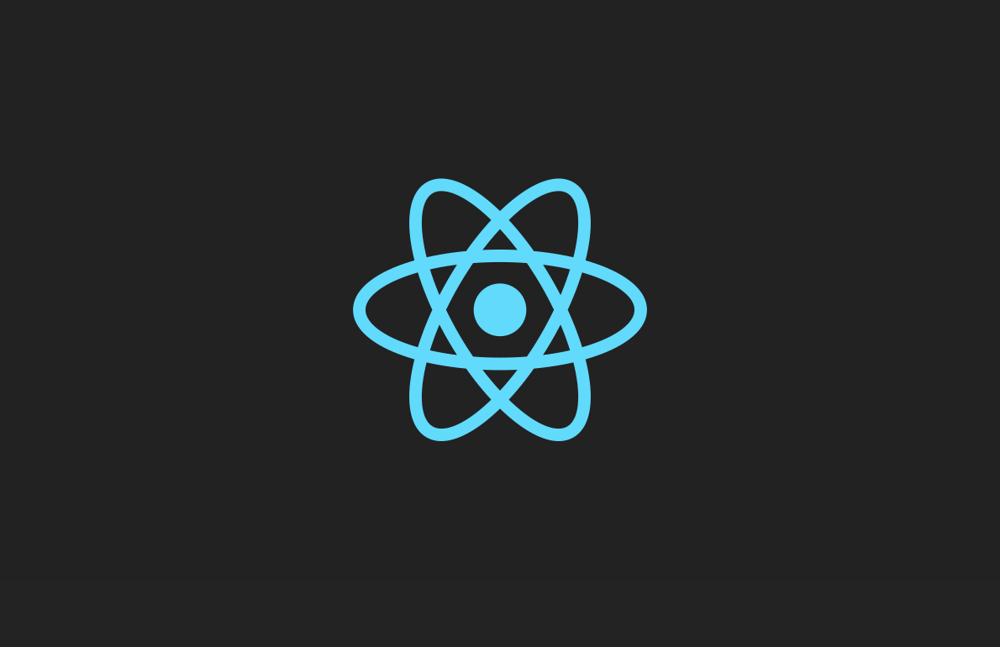

# Ejercicios React

<p align="center">
  
</p>

Este repositorio contiene una colección de ejercicios realizados en React para la asignatura de Desarrollo Web en Entorno Cliente del módulo de DAW.

## 📝 Ejercicios

### 1. [Hola Mundo](./src/ejercicios/e1-hola-mundo.jsx)
Primer ejercicio en React donde mostramos el clásico "Hola Mundo" en pantalla.

### 2. [Contador](./src/ejercicios/e2-contador.jsx)
Implementación de un contador simple con botones para incrementar y decrementar el valor.

### 3. [Saludo con Props](./src/ejercicios/e3-saludo-props.jsx)
Ejemplo de paso de propiedades entre componentes mediante un saludo personalizado.

### 4. [Botón con Evento](./src/ejercicios/e4-boton-evento.jsx)
Manejo de eventos en React mediante un botón interactivo.

### 5. [Perfil](./src/ejercicios/e5-perfil.jsx)
Creación de un componente de perfil con información personal.

### 6. [Lista de Compra](./src/ejercicios/e6-lista-compra.jsx)
Implementación de una lista de compra interactiva.

### 7. [Galería](./src/ejercicios/e7-Galeria/e7-Galeria.jsx)
Implementación de una galería de imágenes interactiva.

### 8. [Inputs](./src/ejercicios/e8-inputs.jsx)
Manejo de inputs controlados en formularios React.

### 9. [Puntuaciones](./src/ejercicios/e9-punjate.jsx)
Manejo de dos botones de puntuaciones +1 y +3 

### 10. [Cuestionario](./src/ejercicios/e10-cuestionario.jsx)
cuestionario con que solo te deja completarlo si es la respuesta correcta

### 10. [ToDo](./src/ejercicios/e11-notas/e11-notas.jsx)
cuestionario con que solo te deja completarlo si es la respuesta correcta

## 🚀 Instalación

```bash
# Clonar el repositorio
git clone https://github.com/tuusuario/ejercicios-react.git

# Instalar dependencias
cd Ejercicios
npm install

# Iniciar el servidor de desarrollo
npm run dev
