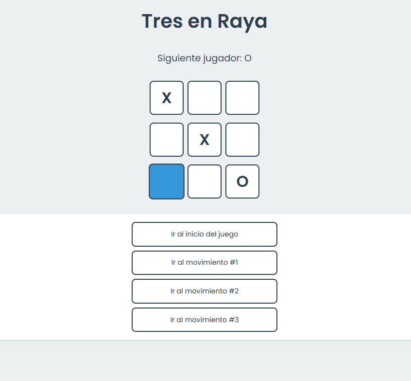

# 🎮 Tres en Raya | React

## 📋 Descripción

Juego clásico de Tres en Raya desarrollado con React y Vite. Implementa un sistema de turnos, historial de movimientos y detección automática del ganador.

## 🚀 Características

- ⭕ Juego por turnos (X/O)
- 📜 Historial completo de movimientos
- 🔄 Función de retroceder jugadas
- 🎯 Detección automática de victoria
- 🎨 Diseño moderno y responsivo

## **📁 Estructura del Proyecto**

### **Componentes**

| Archivo | Descripción | Codigo
| --- | --- | --- |
| `App.jsx` | Componente principal que estructura la aplicación | [Ver código](./src/App.jsx) |
| `Game.jsx` | Gestiona la lógica del juego y estados | [Ver código](./src/Game.jsx) |
| `Board.jsx` | Renderiza el tablero y gestiona las jugadas | [Ver código](./src/components/board.jsx) |
| `Square.jsx` | Componente para cada casilla del tablero | [Ver código](./src/components/square.jsx) |

### **Estilos**

`App.css` contiene todos los estilos de la aplicación:

- Tema oscuro moderno
- Efectos de hover y transiciones
- Diseño responsive
- Variables CSS personalizadas

[Ver código](./src/App.css) 

## **📱 Vista Previa**

## **🎮 Cómo Jugar**

1. Inicia el juego haciendo clic en cualquier casilla
2. Alterna entre X y O
3. Alinea tres símbolos para ganar
4. Usa el historial para retroceder jugadas

